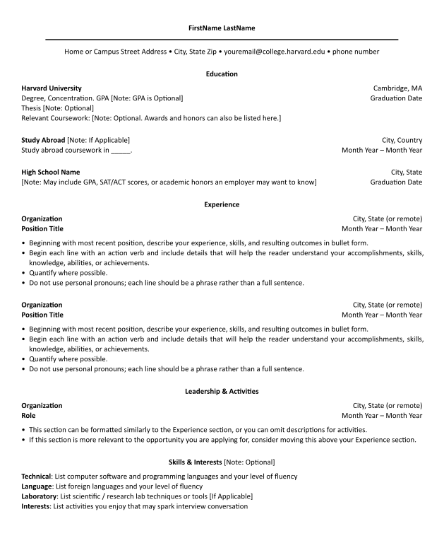

## Harvard College Bullet Point Resume Template in Typst

This is a simple typst template for creating a bullet point resume in the Harvard College resume format.

### How to compile

```bash
typst compile main.typ
```

### Example Output



### License

This project is licensed under the MIT License (haha) - see the [LICENSE](LICENSE) for details.